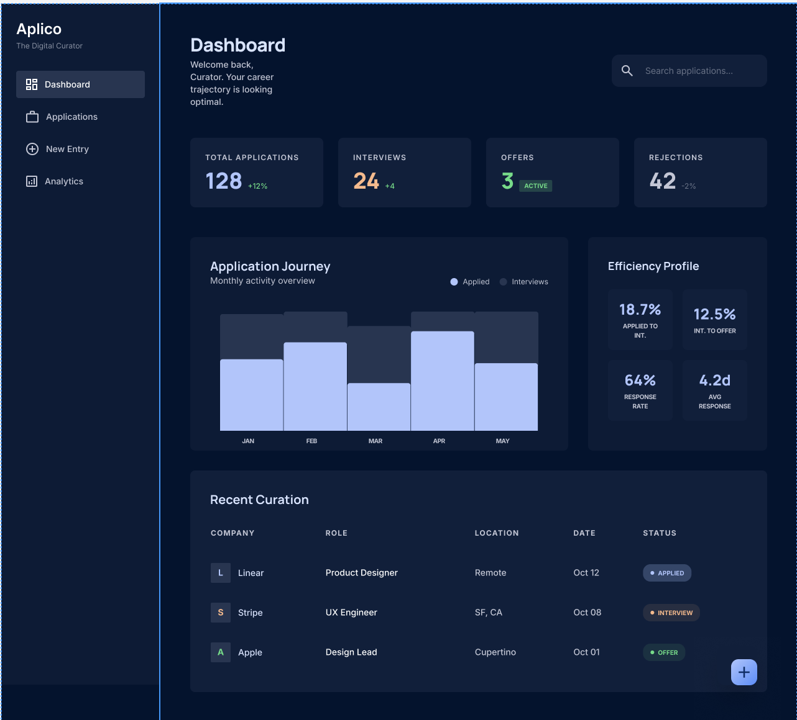
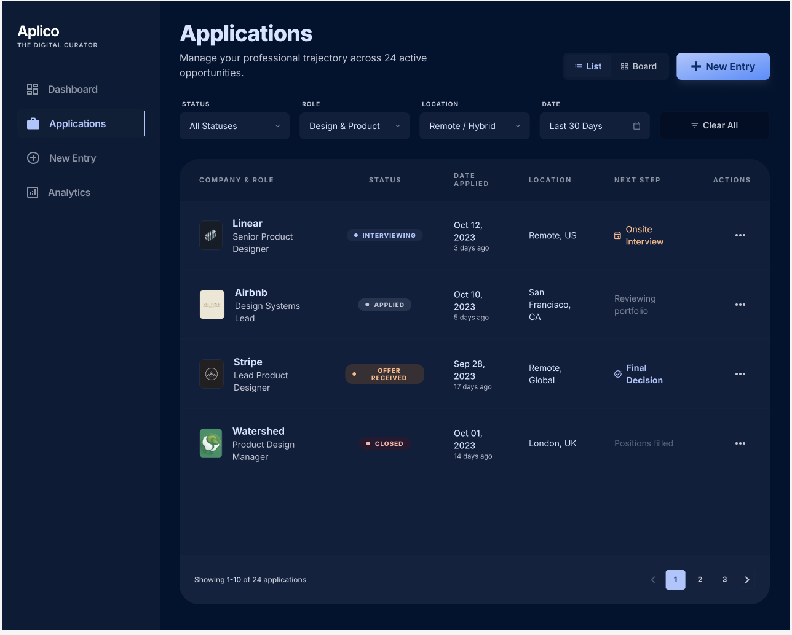
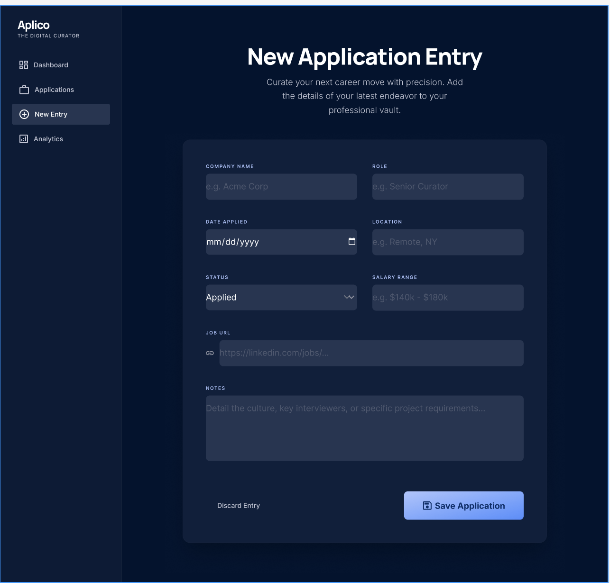

# Aplico

A modern job application tracking app built to help you stay organized during your job search. Track applications, monitor progress, and manage your opportunities efficiently in one place.

## 👤 Who is Aplico for ❓

Aplico is designed for:

- Job seekers who want to stay organized during their application process.
- Developers applying to multiple roles and tracking progress.
- Anyone preparing for interviews and managing follow-ups.
- People who prefer a clean, simple system instead of spreadsheets.

Whether you're actively applying or just exploring opportunities, this tool helps you stay on top of your job search.

## ✨ Features

- 📋 Track all your job applications in one dashboard.
- 🏷️ Categorize applications by status (Applied, Interview, Offer, Rejected).
- 🔍 Search and filter applications by company, role, or status.
- 📝 Add notes and details for each application.
- 📅 Track application dates, follow-ups, and interview stages.
- 🎯 Responsive UI built for desktop and mobile.

## 🚀 Tech Stack

- **Frontend:** Next.js (App Router)
- **Styling:** Tailwind CSS
- **UI Components:** shadcn/ui
- **Formatting & Linting:** Biome
- **Backend:** None included yet (frontend starter app)
- **Database:** None included yet

## 📂 Project Structure

```
.
├── app/                # Next.js app directory (routes & layouts)
├── components/         # Reusable UI components (shadcn-based)
├── lib/                # Utilities and helpers
├── styles/             # Global styles
├── public/             # Static assets
├── biome.json          # Biome config
└── package.json
```

## ⚙️ Getting Started

### 1. Clone the repository

```bash
git clone https://github.com/chingu-voyages/V60-tier2-team-21.git
cd V60-tier2-team-21
```

### 2. Install dependencies

```bash
npm install
```

### 3. Run the development server

```bash
npm run dev
```

Open the app at:

```bash
http://localhost:3000
```

### 4. Build for production

```bash
npm run build
```

### 5. Start the production server

```bash
npm start
```

## 🚀 Deployment

This project is intended to deploy to a modern platform such as Vercel or Netlify.

- Deployment target: TBD
- Production environment: TBD
- Continuous deployment: TBD

## 🧹 Linting & Formatting

This project uses **Biome** for linting and formatting.

### Run lint checks

```bash
npx biome lint
```

### Format files

```bash
npm run format
```

## 🎨 UI System

The project uses **shadcn/ui**, built on top of Tailwind CSS.

- Accessible and customizable components
- Utility-first styling
- Consistent design system

## 👀 Sneak Peek

Here’s a quick look at the app:

### 📊 Dashboard



### 📝 Application Details



### ➕ Add New Application



## Team Documents

You may find these helpful as you work together to organize your project.

- [Team Project Ideas](./docs/team_project_ideas.md)
- [Team Decision Log](./docs/team_decision_log.md)

Meeting Agenda templates (located in the `/docs` directory in this repo):

- Meeting - Voyage Kickoff --> ./docs/meeting-voyage_kickoff.docx
- Meeting - App Vision & Feature Planning --> ./docs/meeting-vision_and_feature_planning.docx
- Meeting - Sprint Retrospective, Review, and Planning --> ./docs/meeting-sprint_retrospective_review_and_planning.docx
- Meeting - Sprint Open Topic Session --> ./docs/meeting-sprint_open_topic_session.docx

## 👥 Our Team

- Fabirez: [GitHub](https://github.com/fabirez)
- Kamaal: [GitHub](https://github.com/Kamaal-Azfar)
- Zahra: [Github](https://github.com/ZahraSoley)
- Deniz: [GitHub](https://github.com/zenidreney/) / [LinkedIn](https://linkedin.com/in/zenid)
- Hajar: [GitHub](https://github.com/hajar-nasr)
- Tochi (PRODUCT OWNER): [GitHub]([(https://github.com/Osira01]) / [LinkedIn](https://linkedin.com/in/liaccountname)
- Olu: [GitHub](https://github.com/doddy77512)

## 📄 License

MIT License

## 🛠️ Notes

Parts of this README were generated with the assistance of AI tools and reviewed for accuracy.
